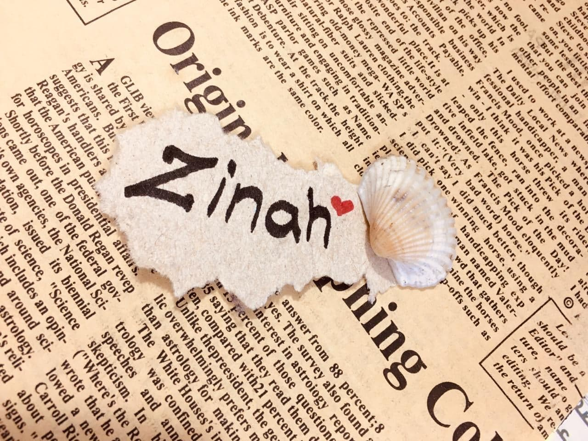

# ZINAHNAJI
 *life is beautiful*

## Ilove the challenge,and i try no matter i have in all the things of my life ,and i love reading because it makes the ability to understand.

Birthday    | 20/10
------------| -------------
Favorite color|  gold
Favorite food  salad
Pinneapple on pizza|<ul><li>[x ] Yes</li><li>[ x]  No</li></ul>

### Hobbies 

 -Decoration work
 - Reading book
 - Travel 
>

#### You can always count on me when... 

I can create beautiful features for websites because I'm using Figma. You can design mobile apps and websites also you can make prototypes in Figma. Additional you can copy a bunch of code of your design...

##### A

###### TL;DR 

When i did interrail with my friends we met a guy in Capri and he became our friend and guide.

<< [previous](https://github.com/DriesDD/markdown-challenge/blob/master/README.md)%7C%7C Ezgi || [next](https://github.com/fawadrafique/markdown-challenge/blob/master/README.md) >>
A 

